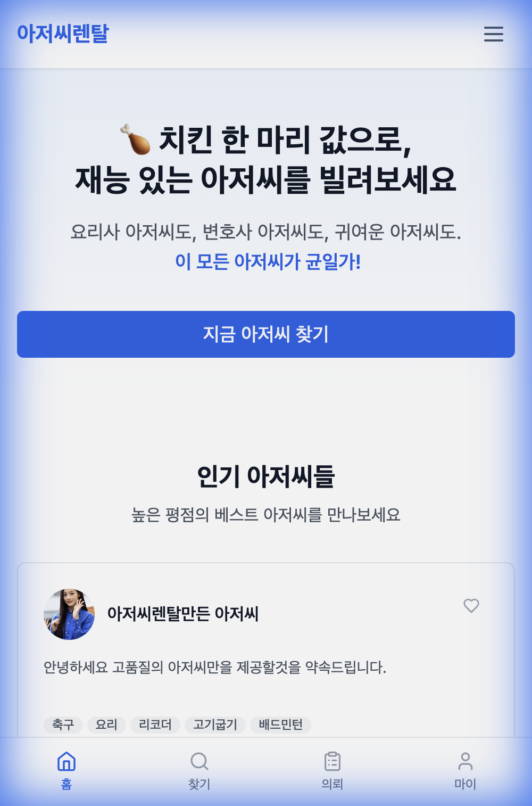
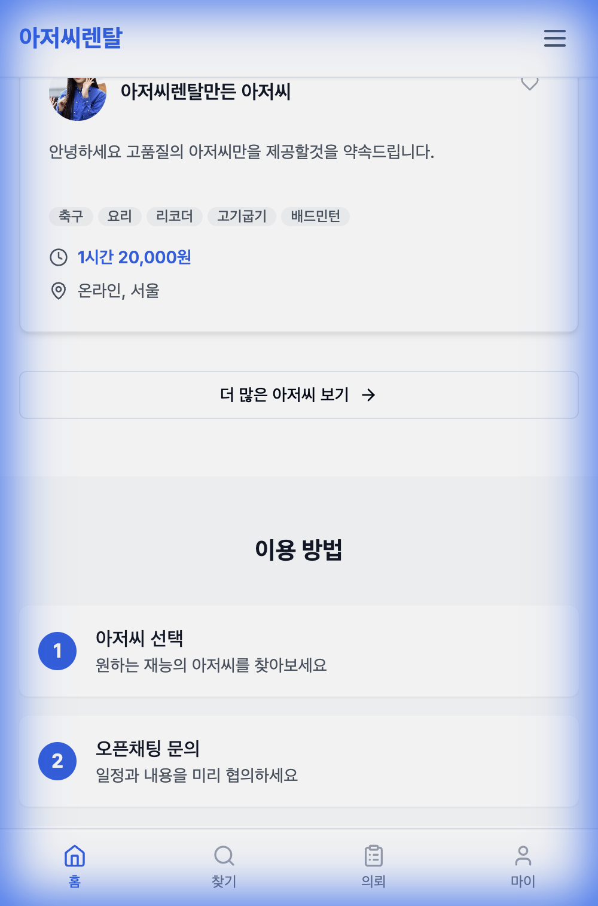
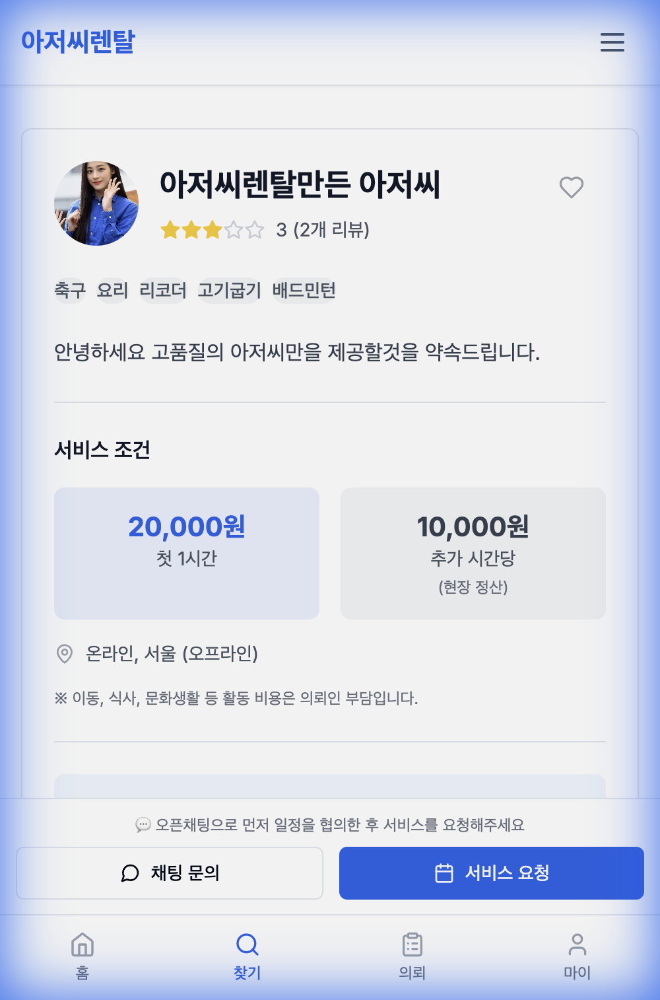

# 비개발자 PM이 AI로 서비스 런칭까지: 아저씨렌탈 제작기

> 코딩은 못 하지만 서비스는 만들 수 있습니다.
> Antigravity로 아저씨렌탈을 런칭한 이야기.

---

## 나는 누구인가

안녕하세요. "나만의 웹서비스 만들기" 스터디장, 기획자 민지입니다.

개발 흐름은 알고 결과물은 만들 수 있지만, 코딩을 직접 할 줄은 모릅니다. 그냥 못 합니다.

취미로 서비스 만드는 걸 좋아해서 자주 사이드프로젝트를 하는 편인데요. 이번에 만든 건 좀 특이합니다.

**아저씨를 빌려드립니다.**

---

## 왜 아저씨를 빌려주게 됐나

저는 아는 척 하는 것을 좋아합니다. 뭔가 배우면 누군가에게 알려주고 싶고, 대화하면서 인사이트를 얻는 걸 즐깁니다.

배움교환, 재능기부 같은 걸 하다 보니 주변에 재능 있는 아저씨들을 알게 됐습니다. 전문직 종사자, 악기 다루는 분, 마케팅 잘하는 분 등등.

그런데 이 아저씨들, 저처럼 아는 척 하는 걸 좋아합니다. 돈을 많이 받으려는 게 아니라, 누군가와 대화하고 자신의 지식을 나누는 것 자체를 즐깁니다. 어떤 분은 무료로도 하겠다고 하더라고요.

**공급자가 이렇게 열정적이라면, 싸게 공급할 수 있겠다.**

그래서 가격을 파격적으로 잡았습니다.
- 첫 1시간: 20,000원 (치킨 한 마리 값)
- 추가 시간: 10,000원

수요자 입장에서는 전문가를 치킨값에 빌릴 수 있으니 나쁘지 않죠. 공급만 충분하면 수요는 따라올 거라고 봤습니다.

---

## 일본에 이미 있다고?

일본에 "おじさんレンタル(오지상렌탈)"이라는 유사 서비스가 있습니다. 아저씨를 렌탈하는 서비스인데, 유사연애 관련 이슈도 있었죠.

하지만 실제로 시장을 조사해보니, 대부분은 아저씨의 재능을 거래하는 형태였습니다. 상담, 조언, 동행 같은 것들이요.

법적 리스크만 잘 피해가면, 오히려 "아저씨를 빌린다"는 컨셉 자체가 노이즈 마케팅이 될 수 있겠다 싶었습니다.

**아저씨 렌탈이요? 그게 뭐예요?**

이 한마디면 바이럴 시작입니다.

---

## 왜 Antigravity인가

AI 코딩 도구가 여러 개 있지만, Antigravity를 선택한 이유는 명확합니다.

1. **진입장벽이 낮다**: 다른 AI 개발 도구들보다 시작하기 쉬움
2. **무료로 충분하다**: 돈 안 들이고도 웬만한 건 다 됨
3. **구글 생태계**: 구글 제품이라 다른 구글 도구와 연동이 좋음

특히 좋았던 건, 나노바나나(이미지 생성)로 디자인 소스를 직접 만들거나, UI 캡처해서 "이거랑 똑같이 만들어줘"하면 거의 그대로 구현해줍니다. 진짜 강력해요.

---

## 서비스 만들기: 뺄 건 빼자

처음 기획할 때 생각한 기능들이 있었어요.

- 결제 시스템
- 리뷰/평점 시스템
- 채팅 기능
- 일정 관리
- 알림 기능

**이 중에서 MVP에 넣은 건?**

- 아저씨 목록/상세 보기
- 오픈채팅 연결
- 서비스 요청 폼

**나머지는 다 뺐습니다.**

결제? 현장에서 정산하면 됩니다.
채팅? 카카오톡 오픈채팅 있습니다. 굳이 만들 필요 없어요.
일정 관리? 오픈채팅에서 조율하면 됩니다.

핵심 가치(아저씨와 사용자 연결)만 되면 나머지는 나중에 붙여도 됩니다.

---

## 모바일부터, 아저씨부터

일반적인 서비스 기준, 모바일 접속 비율이 70% 이상입니다. 데스크톱은 그냥 보너스예요.

그래서 모바일 화면을 기준으로 설계하고, 데스크톱은 자연스럽게 확장되도록 했습니다.



랜딩 페이지에 장황한 설명? 필요 없습니다.

사용자가 사이트에 들어오면 **바로 아저씨 목록이 보입니다**. "이 서비스가 뭔지"는 아저씨들을 보면 알게 되거든요.

전환을 유도하는 가장 좋은 방법은 **보여주는 것**입니다.



---

## 톤앤매너: 진지하면 재미없다

재미로 하는 프로젝트니까 재밌게 가기로 했습니다.

- 슬로건: "아저씨 균일가"
- 가격 설명: "아저씨가 치킨 한 마리 값"
- 에러 메시지도 친근하게

진지하면 크몽이나 탈잉이랑 다를 게 없어요. **유머가 차별점**입니다.

"왜 아저씨만이야? 아줌마는?" 이런 질문이 나올 수 있는데,

일단은 아저씨부터입니다. 아줌마 버전은 수요가 생기면 그때 만들면 됩니다.

---

## 서울 + 온라인, 그게 다야

전국 서비스? 처음부터 욕심 부리면 망합니다.

- **오프라인**: 서울만. 인구 밀집도가 높고 수요가 몰려 있음
- **온라인**: 전국 어디서든 화상으로 가능

두 가지 옵션만. 이게 선택과 집중입니다.

---

## 오픈채팅이 최고다

문의하기 기능을 어떻게 만들까 고민했습니다.

자체 채팅? 까다롭고, 알림 시스템도 만들어야 하고, 귀찮습니다.

카카오톡 오픈채팅? 이미 다들 쓰고 있고, 알림도 자동이고, 편합니다.

당연히 오픈채팅입니다.

다만, 처음에는 로그인 없이 문의 가능하게 했다가, **장난치는 사람들 방지**를 위해 로그인 필수로 바꿨습니다.

로그인이라는 최소한의 허들만 두고, 나머지 기능(목록 보기, 상세 보기)은 로그인 없이 다 볼 수 있게 했어요.



---

## 어드민은 직접 만들었다

아저씨 등록 신청을 어떻게 받을까 고민했습니다.

- **구글 폼**: 간편하지만 관리가 분산됨
- **어드민 페이지**: 처음 만들기 귀찮지만 한 곳에서 관리 가능

결국 어드민을 직접 만들었습니다. 신청 목록 확인, 승인/거절, 아저씨 관리까지 한 곳에서 할 수 있으니 운영이 편해졌어요.

---

## GTM, GA4는 필수 설치팩

Google Tag Manager와 Google Analytics 4. 이건 **무조건 설치**입니다.

지금 당장 볼 건 없어도, 데이터는 쌓이기 시작합니다. 나중에 "언제, 어디서, 얼마나 들어왔지?" 궁금해질 때 보면 됩니다.

네이버 웹로그 분석도 같이 붙여뒀어요. 네이버 검색 유입이 꽤 많거든요.

**일단 설치해두고 나중에 보자. 이건 진짜 추천입니다.**

---

## 검색에 안 나와요

만드는 것까지는 좋았는데, 문제가 하나 있었습니다.

**"아저씨 렌탈"로 검색해도 안 나와요.**

URL이 이랬거든요:
```
ajussirental.com/ajussi/b49185ea-286d-4048-a73c-62325062c358
```

이게 뭔지 알 수 있나요? 검색 엔진도 모릅니다.

그래서 이렇게 바꿨습니다:
```
ajussirental.com/ajussi/camping-gosu
```

"캠핑 고수"라는 키워드가 URL에 들어가니까 검색 엔진이 "아, 이 페이지는 캠핑 관련이구나" 이해합니다.

한글 제목을 자동으로 영어 URL로 변환하는 기능을 추가했고, 중복되면 뒤에 숫자가 붙습니다.

---

## AI한테 물어보니까

요즘은 구글 말고 ChatGPT한테 물어보는 사람도 많습니다.

> "서울에서 캠핑 배울 수 있는 곳 추천해줘"

이런 질문에 우리 서비스가 나오려면, **AI가 우리 사이트 정보를 읽어갈 수 있어야** 합니다.

그래서 AI 봇(GPTBot, ClaudeBot 등)이 사이트를 읽어갈 수 있도록 허용했습니다.

이걸 GEO(Generative Engine Optimization)라고 부르더라고요. SEO의 다음 버전인 셈입니다.

---

## AI랑 일하는 법

AI한테 이렇게 말하면 별로입니다:
> "로그인 기능 만들어줘"

이렇게 말하면 더 좋습니다:
> "오픈채팅 버튼을 누르면 로그인 안 한 사용자는 로그인 페이지로 보내고 싶어. 장난치는 사람들을 막으려고."

**맥락을 주면 AI가 더 좋은 결정을 내립니다.**

그리고 AI가 만든 걸 그냥 쓰면 안 됩니다. 확인하고, 피드백 주고, 다시 수정받고.

- "이 버튼 위치 좀 어색한데 아래로 옮겨줘"
- "에러 메시지가 너무 딱딱해. 좀 친근하게 바꿔줘"
- "모바일에서 보니까 글자가 너무 작아"

이런 식으로 계속 다듬어야 쓸 만한 서비스가 됩니다.

---

## AI도 제안해준다

제가 모르는 것도 AI가 제안해줄 때가 있습니다.

"SEO 상태 어때?"라고 물어봤더니 URL이 검색에 불리하다고 먼저 알려주더라고요. 그래서 슬러그 시스템을 도입하게 됐습니다.

AI가 단순 실행자가 아니라 **조언자** 역할도 해줍니다.

물론 AI가 완벽하진 않아요. 가끔 코드에 버그가 있거나, 맥락을 잘못 이해할 때도 있습니다. 그래서 결과물을 항상 확인하고, 이상하면 다시 물어봐야 해요.

---

## 런칭하고 나서

런칭 초기 유입 전략:
- 지인 네트워크에 공유
- 관련 커뮤니티에 소개
- SNS 바이럴 (아저씨 렌탈이라는 컨셉 자체가 화제성 있음)

광고비 0원으로 시작. 바이럴 되면 좋고, 안 되면 아이디어 자체가 별로인 거니까 빨리 피벗하면 됩니다.

검색 엔진도 등록했습니다. 구글, 네이버 둘 다. 검색 노출까지는 시간이 좀 걸리니까 일단 등록해두고 기다리면 됩니다.

---

## 배운 것들

코딩을 직접 못 해도, 개발이 어떻게 돌아가는지 알면 **더 좋은 요청**을 할 수 있습니다.

"그냥 만들어줘" 대신
"이렇게 하면 문제 있을 것 같은데 다른 방법 있어?"

AI든 개발자든, 맥락을 아는 사람과 일하는 게 훨씬 수월합니다.

그리고 AI가 개발자를 대체한다고? 아직은 아닙니다.

하지만 **기획자가 혼자서 MVP를 만들 수 있게 해주는 건** 확실합니다.

개발자 없이 아이디어 검증까지 할 수 있으니까요. 진짜 되는 아이디어인지 확인하고 나서 개발자를 구해도 늦지 않아요.

---

## 마무리

아저씨렌탈은 완전히 재미로 시작한 프로젝트입니다.

- 아저씨를 빌려준다는 컨셉이 웃겨서
- 주변에 재능 있는 아저씨들이 있어서
- AI로 얼마나 빨리 만들 수 있는지 해보고 싶어서

결과적으로 실제 서비스가 나왔고, 검색에도 노출되고, 사람들이 써볼 수 있는 상태가 됐습니다.

코딩 못 해도 서비스 만들 수 있습니다. 다만, **기획력과 디테일에 대한 집착**은 필요합니다.

AI가 코드를 짜주지만, **왜 이렇게 해야 하는지**는 여전히 사람이 결정해야 하니까요.

---

**서비스 구경하기**: [ajussirental.com](https://ajussirental.com)

---

*작성: 기획자민지*
*제작 도구: Antigravity (Google)*
